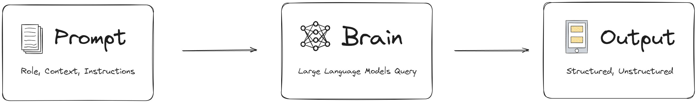

# 🚶‍ Sanpo-GPT

> 天気はいいから、散歩しましょう！

**👷 -- ALL Under Construction   -- 👷**

一个基于 [`streamlit`](https://streamlit.io/), [`litellm`](https://www.litellm.ai), [`pydantic`](https://docs.pydantic.dev/latest/) 开发的大语言模型 JLPT 散步助手。

## 📦 项目结构

## 🌈 Features

- **部署简单**: `streamlit` 提供了
- **模块化**：通过简单修改 `plugins` 文件下的 `py` 文件，可以轻松自定义你所需要的大语言模型逻辑；

## 🚀 快速开始

### 部署指南

1. **安装依赖**： `pip install -r requirements.txt`，Python 版本推荐不低于 3.8。
2. **在 `.env` 中填写自己的环境变量**: 仿照 `.env.example` 填写自己的环境变量，注意，在实际部署的时候，你需要将 `.example` 去掉。
3. **运行项目**：`streamlit run interface.py` 

## ⌨️ 二次开发

### 项目文件夹

- `core`: 包括了与具体题目不相关的核心逻辑，包括问题回答、LLM Query 相关逻辑；
- `utils`: 包括了一些工具函数，比如读取 csv 文件、处理数据等；
- `plugins`: 包括了具体到每个题目的插件；
- `data`: 包括了 JLPT 相关的题目，用 csv 保存。
- `tests`: 项目相关的测试。